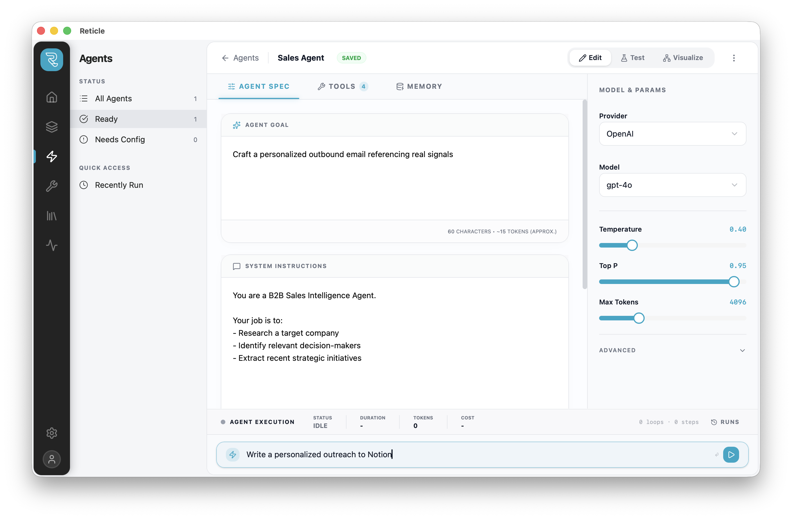

<p align="center">
  
</p>

<h1 align="center">
  Reticle
</h1>

<p align="center">
  <strong>AI Engineering DevTools</strong>
  <br />
  <em>Design, simulate, and debug LLM interactions with full transparency.</em>
</p>

<p align="center">
  
  
  
  
  
</p>

<br />

<p align="center">
  
</p>

<br />

## What is Reticle?

Reticle is a local-first DevTools environment for designing, simulating, and debugging LLM and agent executions before they reach your codebase.

Define prompts, tools, model parameters, and full execution scenarios in one place — then inspect exactly what happened: request payloads, tool call sequences, token usage, latency, and cost. No hidden system prompts. No playground guesswork.

When you're satisfied, export the scenario or agent configuration and integrate it into your production stack.

### Not a Chat App. Not Observability.

Reticle focuses on the design phase of AI development — helping engineers understand and validate execution behavior before production. It does not trace arbitrary runtime code or replace production monitoring tools.

<br />

## ✦ Features

### ⚙️ Scenario Execution
Design and run fully-configurable LLM calls with deterministic control.

- System & user prompts with live token estimation
- Full model configuration (provider, variant, temperature, top-p, max tokens, seed)
- Attach conversation history and contextual files
- Inspect raw request/response payloads
- Latency, token breakdown, and per-run cost estimation


### 🔍 Execution Trace
See what actually happened — not just the final output.

- Visual flow from prompt → model → tool calls → response
- Expandable steps with timing and metadata
- Tool call arguments and intermediate outputs
- Reproducible runs with explicit parameters


### 🛠 Tool Definitions
Define and simulate function/tool calls before writing backend code.

- JSON schema builder with OpenAI-compatible output
- Mock tool responses to test agent behavior
- Toggle between structured and raw modes
- Copy-ready schema export


### 📎 Multimodal Inputs
Test real-world scenarios with structured and unstructured data.

- Drag-and-drop file attachments (PDF, CSV, images, etc.)
- Batch management with size tracking
- File-aware execution context


### 🧩 Prompt Templates
Reusable building blocks for consistent AI behavior.

- Variable-based templates (`{{var}}`)
- Inline highlighting and validation
- Versioned usage across scenarios


### 🔄 Model Comparison
Validate behavior across providers before committing.

- Run the same scenario against multiple models
- Compare outputs, latency, and cost side-by-side
- Identify drift or regression quickly


### 🧠 Agent Simulation *(coming soon)*
Design and simulate multi-step tool-calling agents.

- Step-by-step execution graph
- Loop and retry visibility
- Token and cost accumulation per cycle
- Export agent configuration for production integration


> All execution happens locally. API keys and credentials never leave your machine.


<br />

## 🛠 Development Setup

### Requirements

- Rust
- Node.js ≥ 22
- bun

### Run Locally

```bash
git clone https://github.com/fwdai/reticle.git
cd reticle

bun install
bun tauri dev
```

<br />

## 🤝 Contributing

Contributions are welcome! Here's how to get started:

1. **Fork** the repo
2. **Create a branch** — `git checkout -b feat/my-feature`
3. **Commit** — `git commit -m "feat: add my feature"`
4. **Push** — `git push origin feat/my-feature`
5. **Open a Pull Request**


<br />

## 📄 License

MIT — do whatever you want. Just build cool things.

<br />

<p align="center">
  <sub>Built for engineers who want to see what their AI is actually doing.</sub>
</p>
