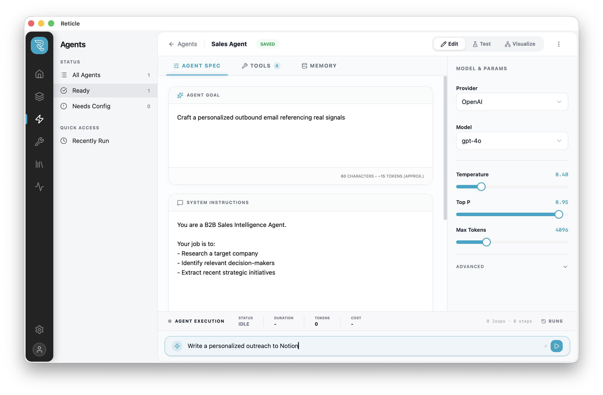

<p align="center">
  
</p>

<h1 align="center">Reticle</h1>

<p align="center">
  <strong>Postman for AI.</strong><br />
  Design, evaluate, and debug LLM scenarios and AI agents across providers — entirely on your machine.
</p>

<p align="center">
  <a href="https://reticle.run">reticle.run</a> &nbsp;·&nbsp;
  <a href="https://github.com/fwdai/reticle/releases">Download</a> &nbsp;·&nbsp;
  <a href="#quick-start">Quick Start</a> &nbsp;·&nbsp;
  <a href="https://github.com/fwdai/reticle/issues">Report a bug</a>
</p>

<p align="center">
  
  
  
</p>

> **Public beta.** Core features work and are actively used, but this is early software — things may break and APIs may change. [Open a bug report](https://github.com/fwdai/reticle/issues) if you hit an issue. We'd love your feedback.

<br />

<!-- Replace with a hero GIF or screenshot of the app -->
<p align="center">
  
</p>

<br />

---

## The problem

AI development tooling is fragmented. Provider playgrounds, eval frameworks, cloud-hosted observability platforms — each solves one piece of the development workflow.

There's no unified environment that takes you from designing a prompt or agent, through debugging and evaluation, to shipping with confidence that nothing broke — all in one place.

Reticle is that environment. And it runs entirely on your machine, so your prompts, agents, and data stay yours.

---

## Features

Reticle is a desktop app — everything runs locally, no account required, no context switching between tools.

### Scenarios
Build structured prompts with variables, multi-turn history, and full model control — provider, variant, temperature, seed, max tokens. Run the same scenario against GPT-4o, Claude, and Gemini and compare outputs, latency, and cost side by side.

### Agents
Define agents with goals, system instructions, and tools. Execute them step by step, inspect every tool call and intermediate output, and debug exactly where things go wrong.

### Evals
Write assertions on your outputs and catch regressions before you ship. Supports `contains`, `equals`, `not_contains`, `LLM judge`, `tool_called`, `tool_not_called`, `JSON schema`, `tool_sequence`, and more. Run evals on scenarios and agents alike.

### Tools
Attach tools to scenarios and agents. Use mock JSON responses while designing, or run real Deno code for live execution. Define once, use everywhere.

### Templates
Save reusable system and user prompts with `{{variables}}`. Build a library of battle-tested building blocks and stop copy-pasting prompts across projects.

### Runs history
Every execution is stored locally. Review outputs, costs, and latency across all your runs — nothing is ever thrown away.

### Private by default
API keys are injected via a local proxy server. Your prompts, agents, data, and API credentials never leave your machine.

---

## Quick start

### Download

Get the latest release from [reticle.run](https://reticle.run) or the [Releases page](https://github.com/fwdai/reticle/releases).

| Platform | Format |
|---|---|
| macOS (Apple Silicon) | `.dmg` |
| macOS (Intel) | `.dmg` |
| Linux | `.AppImage` / `.deb` |
| Windows | `.msi` |

### Build from source

```bash
# Prerequisites: Rust, Bun
git clone https://github.com/fwdai/reticle
cd reticle
bun install
bun run setup       # downloads Deno sidecar
bun run tauri dev
```

---

## Contributing

Issues and PRs are welcome. For anything significant, open an issue first so we can align on direction before you invest time in it.

```bash
bun run dev           # frontend only
bun run tauri dev     # full app with hot reload
bun run test          # unit tests
bun run test:e2e      # end-to-end tests (requires built binary)
```

---

## License

MIT — [LICENSE](LICENSE)

---

<p align="center">
  <sub>Built for engineers who want to know what their AI is actually doing.</sub>
</p>
